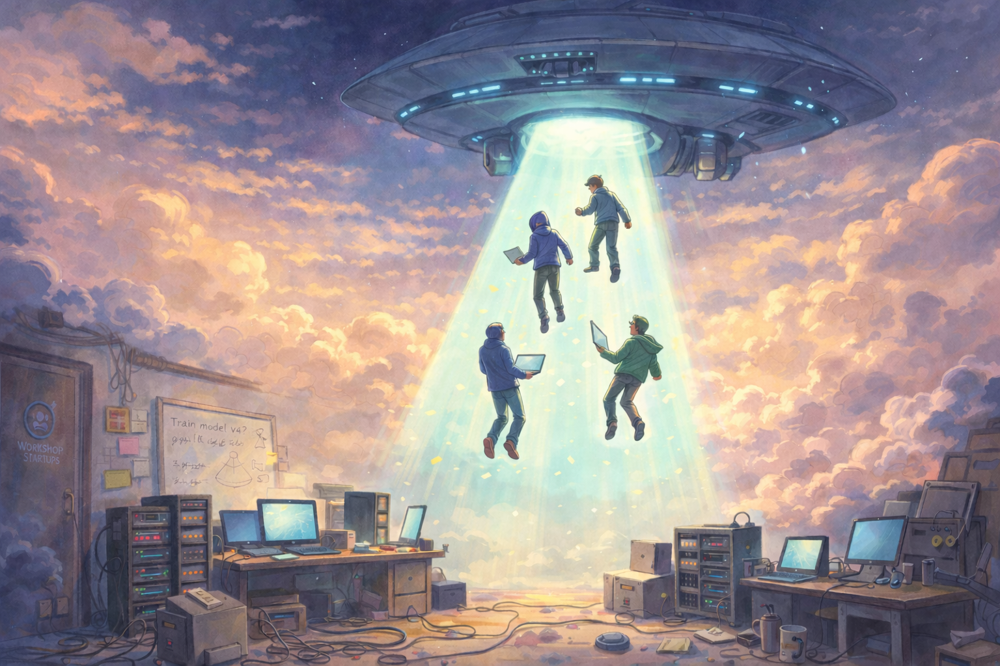
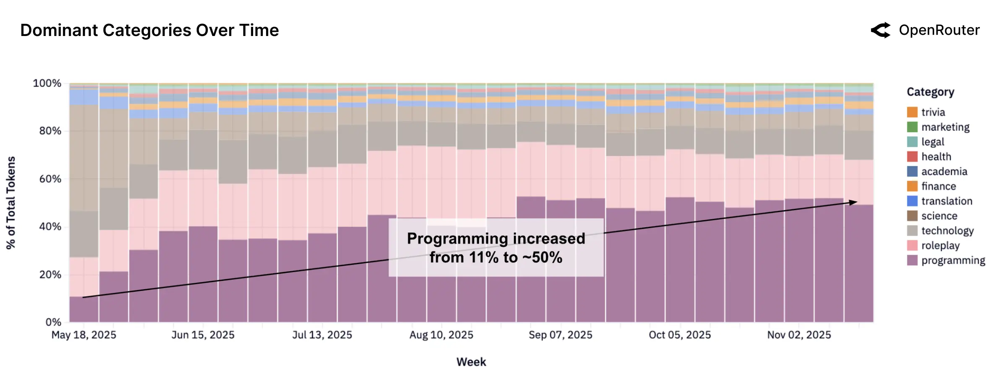

Throughout startup history, an acquihire meant the company failed. The product didn’t break out, revenue growth stalled and the board found a soft landing.
A bigger tech company would buy the assets, but the transaction was for the team and not the business or product. Most of the 
consideration (cash + equity) would flow to the founders through retention packages, some employees would be brought on and investors typically got 
somewhere between zero and their original investment back. Effectively the acquirer was recruiting a hard charging team with specific technical domain expertise.

But in the AI era a new category of expensive acquihires has emerged. [Inflection](https://www.reuters.com/technology/microsoft-agreed-pay-inflection-650-mln-while-hiring-its-staff-information-2024-03-21/), 
[LoveForm](https://www.cnbc.com/2025/05/21/openai-buys-iphone-designer-jony-ive-device-startup-for-6point4-billion.html), 
[Windsurf](https://www.siliconrepublic.com/start-ups/cognition-windsurf-acquisition-ai-coding-google-licensing), 
[Scale AI](https://finance.yahoo.com/news/meta-acquire-49-stake-scale-145856533.html), [Adept](https://techcrunch.com/2024/06/28/amazon-hires-founders-away-from-ai-startup-adept/), [OpenClaw](https://venturebeat.com/technology/openais-acquisition-of-openclaw-signals-the-beginning-of-the-end-of-the).  
While some of these deals are not as egregious as hyped up in the press, the trend is real. 
If this trend continues it will have a profound impact on the relationship between start-up founders, investors and employees.


## The four levels of acquisitions

Traditionally, acquisitions would fall into one of four categories

```
  $$$$, bankers involved, top shelf liquor, steak dinner celebration
                            ▲
                            │
                 ┌─────────────────────────┐
                 │        BUSINESS         │
                 │  ex: Activision → MSFT  │
                 └─────────────────────────┘
                            │
                            │
                 ┌─────────────────────────┐
                 │        PRODUCT          │
                 │  ex: Instagram → Meta   │
                 └─────────────────────────┘
                            │
                            │
                 ┌─────────────────────────┐
                 │       TECHNOLOGY        │
                 │  ex: DeepMind → Google  │
                 └─────────────────────────┘
                            │
                            │
                 ┌─────────────────────────┐
                 │          TEAM           │
                 │   ex:  acquihires       │
                 └─────────────────────────┘
                            │
                            ▼
         $, interview loops, beer, celebrate at In n' Out
``` 


## The mega-acquihire

Mega-acquihires get a lot of press attention because they imply 
companies are paying numbers once reserved for elite atheletes to hire engineers. 
   
But when you look closely, these deals are not all the same. They fall into two categories: 
1. **Normal acquihires** -- where sophisticated investors are finding soft landings for companies that raised too much money. 
2. **Team + Tech acquisitions** -- the acquirer believes they're buying into a market that's about to be worth trillions.    
3. **Whatever Meta Superintelligence labs is doing** -- ¯\\\_(ツ)\_/¯

### DeepMind → Google (2014): Team + Tech

Google's purchase of DeepMind in 2014 was arguably the first mega-acquihire. But this was really a team + tech deal. 
DeepMind had made genuine breakthroughs combining reinforcement learning and neural networks. 
The company had no product and little revenue, but Demis Hassabis, Mustafa Suleyman, 
and Shane Legg had clearly built something that went on to  change the world. 
Google paid over $500M—unheard of at the time—because they were buying both the people *and* the technology 
they'd created. 
In hindsight, this was a bet that paid off.

### Inflection → Microsoft (2024): Normal Acquihire, Big Numbers

Despite the headlines, Microsoft's "acquisition" of Inflection AI looks far more like a traditional acquihire than a mega-deal. 
Yes, Microsoft paid roughly $650M for a "technology license" and hired the co-founders and research team. 
But look at the structure: Inflection had raised $1.5B and their personalized chatbot Pi was clearly losing to ChatGPT. 
Microsoft was already the largest investor. Reid Hoffman, a co-founder of Inflection, was already on Microsoft's board.

The $650M went to the company, not the founders. Investors like Greylock reportedly made 1-1.5x on their capital—exactly what you'd expect from an acquihire soft landing. 
The board found an exit for a company that wasn't going to win its market. 
The numbers are big because $1.5B had been invested, but the *structure* is classic acquihire.

### Adept → Amazon (2024): Normal Acquihire

Amazon's deal with Adept followed the Inflection template: ~$650M for technology licensing plus hiring the founding team sounds like a mega-deal,  
but Adept had raised over $400M and their agent product hadn't found much traction. 
This is another soft landing where investors got something back and founders got lucrative high profile jobs at Amazon. 
Acquihire mechanics, just with larger checks.

### Cognition/Windsurf → Google (2025): Team + Tech

This is not a normal acquihire with big numbers. Google paid $2.4B while Windsurf had raised $243M. Looking back in March 2026, 
betting on AI codegen in Q2 2025 was an incredingly well timed bet as codegen broke out as the dominant AI use case in the subsequent year.

Google paid a lot to licesne tech and bring on a team with expertise in a domain that subsequently exploded.  



### Scale AI → Meta: ¯\\\_(ツ)\_/¯


### NFDG → Meta: ¯\\\_(ツ)\_/¯

 
### io.net/OpenClaw → OpenAI (2025): Team + Tech

OpenAI's acquisitions tell you where they think the bottlenecks are. 
The OpenClaw deal brought in robotics expertise—founders who understand embodied AI and physical-world interaction. 
As OpenAI looks beyond chatbots toward agents that can act in the real world, they need people who've built those systems before.

### The Pattern

Despite the hype, most mega-acquihires are either:
1. **Normal acquihires** where sophisticated investors are finding soft landings for companies that raised too much money, or
2. **Team + tech deals** where the acquirer believes they're buying into a market that's about to be worth trillions

The numbers are big because this is a once-in-a-generation technology shift and the players have unlimited pockets. But the underlying mechanics—buy talent, buy technology, find exits for struggling companies—are the same as they've always been. What's changed is the scale of the opportunity, and therefore the scale of the checks.


## Why?

There's a feeling in the industry that we are in a race to AGI. Whether you believe that timeline is 2 years or 20, the major labs are acting like it's imminent. And in that race, the scarcest resource isn't compute or data—it's the small number of people who truly understand how to build these systems.

The engineers who can optimize a training run to squeeze out an extra percentage point of efficiency. The researchers who have intuition about why a model is behaving strangely. The infrastructure leads who can keep a thousand GPUs humming in concert. Call them GPU whisperers. There are maybe a few thousand of them in the world, and every major lab wants them.

Here's the uncomfortable truth: the codebase doesn't matter that much anymore. Whatever software your AI startup has built, a talented team with modern AI tools can probably replicate it in months, not years. The moat isn't the code. The moat is the people who wrote it and the tacit knowledge in their heads about what works and what doesn't.

So when Amazon looks at Adept, they're not thinking "we need this agent framework." They're thinking "we need the people who figured out how to build an agent framework before anyone else did."

## Misaligned incentives

These mega-acquihires create a fundamental tension between founders and investors that the traditional startup playbook never anticipated.

### VCs

In a classic acquihire, everyone loses together. The company failed, investors get little, and founders get modest retention packages. It's not great, but the incentives are roughly aligned.

The new structure is different. When Amazon pays $650M for Adept's "technology license" and simultaneously hires the founders with massive compensation packages, most of that value flows to the team, not the cap table. Founders can walk away wealthy while investors eat a loss on a company that raised hundreds of millions.

VCs have noticed. The NVCA has updated its model legal documents with new protective provisions specifically designed to block these "license and release" transactions:

> *"any license or transfer of the Corporation's (or its subsidiaries') intellectual property or assets to a third party in a material transaction or series of related transactions that, viewed in the aggregate, would be material and in connection with which such third party or its affiliates contemporaneously directly engages the services of any of the Corporation's senior executives in their individual capacities (including transactions commonly referred to as acquihires)"*

In plain English: you can't license away the company's IP while simultaneously taking a job at the acquirer without investor approval. Expect to see this language in every AI term sheet going forward.

### Employees

The other losers are rank-and-file employees. In a traditional acquisition, everyone's equity gets bought out at the same price. In these structured deals, founders negotiate personal retention packages while the company's common stock may be worth little. The engineer who joined early and took a pay cut for equity can end up with nothing while their CEO walks away with $50M.

## So What?

The conventional wisdom has always been: don't build a company to be acquired. Build a company to build a great business. Acquisitions should be a happy accident, not the goal.

That advice still holds. Building for acquisition is still a bad strategy—you're optimizing for a low-probability outcome that depends entirely on someone else's priorities.

I think what has changed is that the race for AI domination is so hot that if your team can demonstrate the ability to build generational tech that results in step-change, then the big companies are willing to spend enormous amounts of money to bring you on.

But here's the paradox of the AI era: even as we're told that AI will automate human jobs, the teams that build AI have never been more valuable. The scarcity of true AI talent means that even "failed" companies can generate enormous outcomes for their founders.

This creates a strange new calculus for AI founders. You can raise $100M, fail to find product-market fit, and still walk away wealthier than founders who built profitable businesses in other sectors. The acquihire is no longer a consolation prize. For some, it's become the strategy.

Whether that's good for innovation, for investors, or for the employees who join these companies is a different question. But it's the reality of the market we're in.
