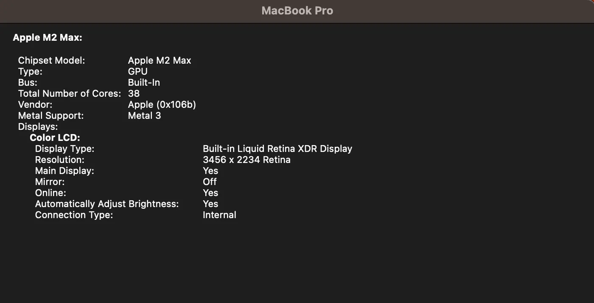
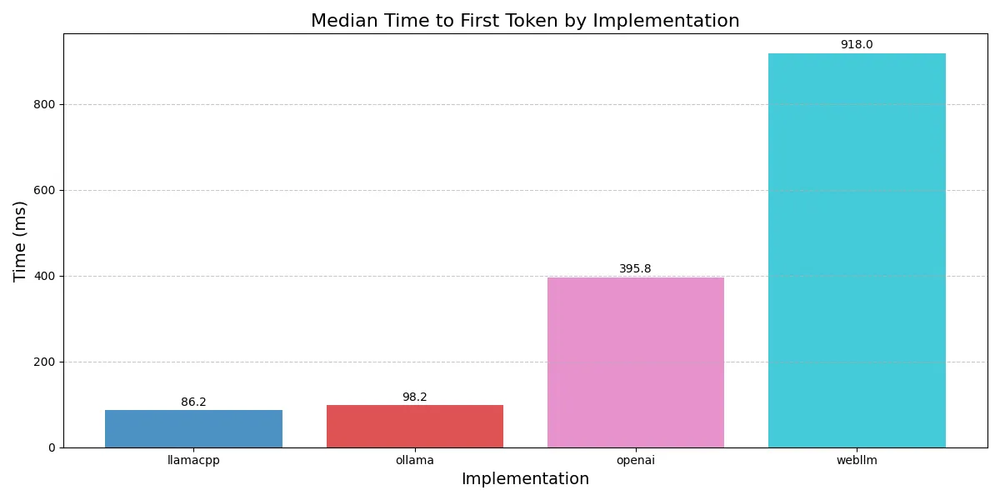
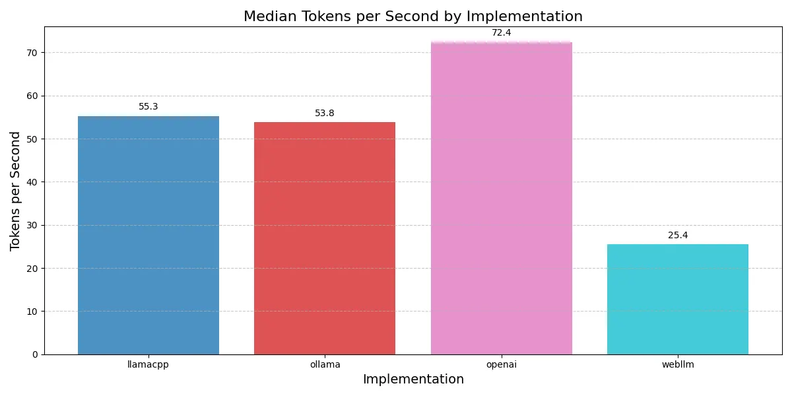
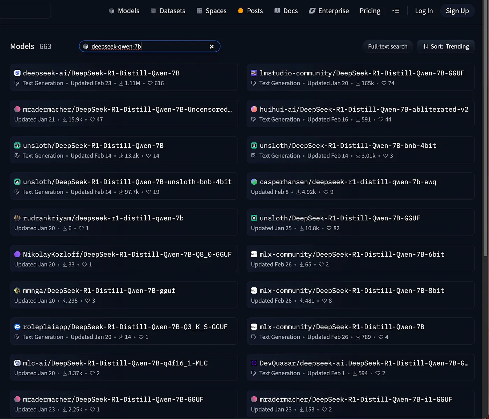

*Originally published on [Relta Blog](https://medium.com/@aazo11/local-llm-inference-897a06cc17a2)*

I stumbled into local inference during a side quest. The main mission was to build a text-to-SQL product. Curiosity hijacked the roadmap: could I cram an entire GenBI stack into the browser?

The prototype never shipped. But I did fall into the local inference rabbit hole. Though "AI inference" is not a listed feature on my laptop spec sheet — through the magic of open source software it can now run powerful LLMs in its browser tabs for free. It's impressive. Just not quite production-ready as a developer platform.

## Why bother with local compute?

From mainframes to PCs to the cloud, compute has swung between centralization and edge. Now it's drifting back toward the edge — at least if you squint through the hype. But most users don't actually care where computation happens. They want it to be fast, and they want it to be cheap.

For example: Figma isn't popular because it runs on WebAssembly — users love it because it feels instant. DuckDB isn't getting traction in the data world because it fits on a laptop — it's being deployed because it can trim Snowflake bills.

Most applications still run in the cloud. However there are four benefits to moving compute to the local device:

- Cost
- Privacy  
- Speed
- Enabling offline use

Local inference is not new: iPhone facial unlock has implemented local inference on mobile devices at scale since 2018. Facial unlock wouldn't work without local inference: it has to be fast, work offline, be private and not cost Apple money every time someone tries to unlock their phone.

As software applications increasingly integrate LLMs, pushing AI inference to the edge can have the same upside.

## Frameworks

I tested the following local inference frameworks together with quantized versions of DeepSeek-R1-Distill-Qwen-7B.

- **llama.cpp**: C/C++ core, highly optimized. An amazing project by Georgi Gerganov.
- **Ollama**: A product and business built on llama.cpp. Better DevEx and model library curation.
- **WebLLM**: Browser-based inference with WebGPU acceleration developed at Carnegie Mellon. Built on MLC.

I ran the inference benchmarks against OpenAI's gpt-4.0-mini as a baseline comparison. The benchmark code can be found here.

## Performance

Tests were run on my Macbook Pro with the following chip specs, with 32GB of RAM.

The metrics I tracked were median time to first token (TTFT) and tokens per second (TPS).

As the chart above shows, llama.cpp and Ollama are both blazing fast in TTFT. OpenAI is slightly slower, likely due to network overhead and authentication. WebLLM was the slowest.

In terms of TPS, llama.cpp and ollama are comparable, which makes sense as they are the same under the hood. WebLLM topped out at only half of the TPS of the other frameworks. I can only assume this is because WebGPU acceleration is not as efficient in utilizing local GPU as the llama.cpp implementation that accesses the GPU directly.

All the local inference solutions were slower than OpenAI running gpt-4.0-mini, a considerably larger model.

While I did not track memory usage or CPU/GPU utilization, I did not notice any noticeable side effects while using other apps on my laptop as the benchmarks ran.

## Mo' Models, Mo' Problems

While the performance of local inference lags cloud solutions, it is already good enough for many tasks. This brings us to the main problem I encountered: finding and deploying the correct model for a given task.

Given the resource constraints, the models that run locally must be much smaller than models running on the cloud. For a developer, there is currently no way to find (or easily tune) a model that can do "text-to-SQL" and work on a Macbook with M2 chip. Even when I had shelved the prototype idea and was just aiming to benchmark these tools with deepseek-qwen-7B, I had to decide which of the 663 different models that match this name on HuggingFace I should download for llama.cpp.

Furthermore, even a quantized version of a distilled 7B model is over 5GB. Downloading and loading these models is very slow even on fiber internet. For an application developer, this leads to a degraded initial user experience of the application. For example, if your webapp uses WebLLM, the user will need to sit for a few minutes while the model is being downloaded to their machine.

## Final thoughts

Local LLM inference is possible. It works today, but the developer tooling will need to mature before real world applications leverage local inference beyond niche use cases.

Any real solution will need to make it dead simple to train and deploy small, task-specific models — and integrate tightly with cloud LLMs. It will have to handle downloads, caching, and local execution behind the scenes, so the user never notices where the model is running or how it got there.