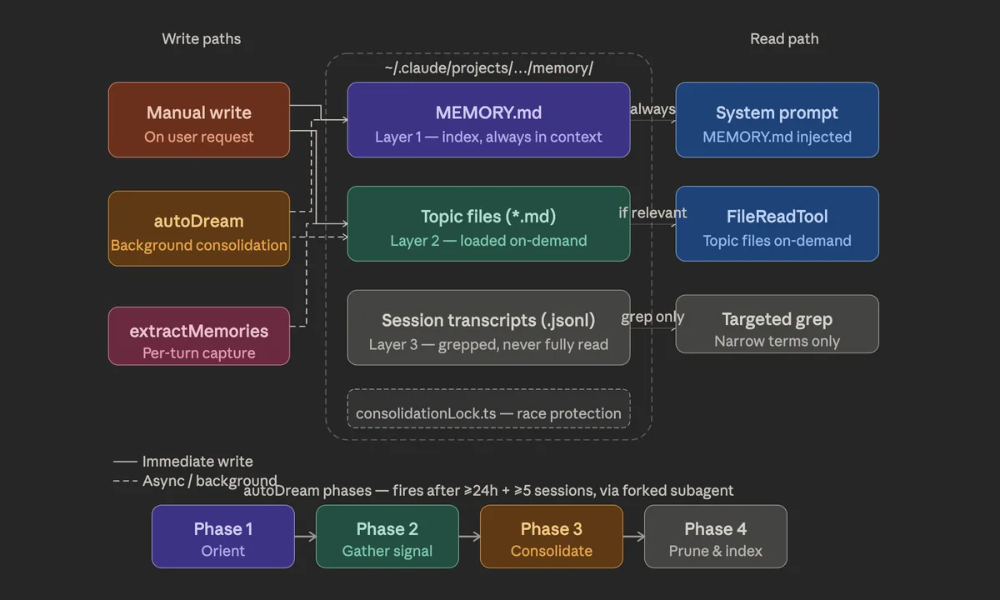

In [Part 1](https://www.aazo11.dev/blog/long-horizon-agents-part-1), I laid out the five systems I believe are missing before agents can graduate from completing tasks to owning outcomes: memory, learning, goal orchestration, a durable execution layer and a toolchain ecosystem. This post dives into one the five: agent memory.

To understand agent memory we shouldn't think of it as a place to store the past. We need to think of memory as a harness-level control system that decides which previous experiences should affect future behavior. The need for memory in the long horizon context should be clear, but to provide a few examples:
- An agent cannot pursue a goal over months if it forgets why the goal/sub-goal matters 
- Learning can't happen without memory: an agent cannot learn if the outcome of one attempt disappears before the next 
- It cannot coordinate with other agents if each action begins with an isolated view of the organization

It is tempting to describe this as a storage problem. Save the agent's interactions, embed them, and retrieve the closest results before the next model call. That produces persistence, but not necessarily memory. A useful memory system must decide what to write, how to represent it, when to retrieve it, how to resolve conflicting information and whether/how an outcome should modify future behavior. Current systems implement this functionality outside the model, in the harness layer that controls the agent loop.


## Memory as a stateful control loop

At time `t`, an agent receives an observation, assembles context and chooses an action. We can therefor describe a simplified agent without memory as:

```
action_t = model(instructions, recent_messages, observation_t)
```

A memory-augmented agent adds persistent state `M_t`, a write policy `F`, a retrieval policy `R`, and a context budget `B`:

```
context_t = R(query_t, M_t, B)

action_t = model(
  instructions,
  working_state_t,
  context_t,
  observation_t
)

M_t+1 = F(
  M_t,
  observation_t,
  action_t,
  outcome_t
)
```

`F` determines which observations become persistent state and how they revise existing records. `R` selects the state that reaches the next model call. Both can combine stochastic compute and deterministic code. Outcomes may arrive much later than actions: for a DevOps agent a deployment can appear successful and cause a regression hours later. The write path must associate delayed evidence with the original action and revise any lessons derived from it.

The implementation of memory comes down to three connected choices: the write policy, the read policy and the storage representation. Claude Code gives us a concrete example of how a harness combines them.

I came across [himanshu's walkthrough of Claude Code's memory architecture](https://x.com/himanshustwts/status/2038924027411222533) while reading about memory systems. The diagram separates the paths that create and revise memory from the paths that bring it back into context:

[](https://x.com/himanshustwts/status/2038924027411222533)

*Source: [himanshu on X, March 31, 2026](https://x.com/himanshustwts/status/2038924027411222533). This is a source-code analysis, not an official architecture diagram. Internal mechanisms such as `autoDream` and `extractMemories` reflect the version analyzed; the walkthrough below uses public documentation for shipped behavior.*

To follow these choices through one task, imagine using Claude Code to investigate a database migration that broke an older worker. During the investigation, the developer explains that customers upgrade their workers independently of the backend, and that a rollout tracker records which versions are still running. This is an illustrative session, not a reported incident. What should survive it, and how should that information affect the next migration?

## Write policy: what becomes memory?

A write policy determines what gets retained, who interprets it and when the result becomes available. Three approaches are useful to distinguish.

**Automatically capture the execution.** Claude Code [records messages, tool calls and results in local JSONL session files](https://code.claude.com/docs/en/how-claude-code-works#work-with-sessions). In our example, that could preserve the failed query returned by a tool, the investigation and the developer's explanation. Recording the session does not require an immediate decision about which detail will matter later.

This preserves evidence that a later read can revisit. The cost moves to that read: someone must find the relevant exchange and interpret it. A transcript also only captures what reached the session. A worker error in an external logging system is absent unless the agent or user brought it in. Retention is therefore a policy too: deleting old records removes the option to reinterpret them later.

**Let the active agent write a memory.** Claude Code's [auto memory](https://code.claude.com/docs/en/memory#auto-memory) selectively saves user information, feedback, project context and references. Its documented policy skips facts recoverable from code or Git history, and instructions already in `CLAUDE.md`.

That distinction changes what is worth saving from our investigation. The patch records which column changed. A more useful memory might be: “Customer workers upgrade independently. Before removing schema compatibility, check the customer rollout tracker.” The durable information is the operating constraint and where to verify it. Copying today's worker versions into a permanent note would create another record that could become stale.

The benefit is less reconstruction on the next task. The risk is premature interpretation: the agent might turn one customer's delay into a rule about every deployment. A useful note should preserve the scope of the developer's correction and distinguish it from the agent's diagnosis. References to supporting evidence make that interpretation easier to revisit.

**Use a separate extraction pipeline.** Another design is to process recorded sessions independently of the agent doing the work. An extractor could turn our exchange into fields such as customer, rollout constraint, source message and observation time. This is an alternative architecture, not a claim that Claude Code's documented auto memory runs this pipeline. It gives the application a consistent schema and allows extraction to be rerun when the policy changes, provided the source history survives.

The extra processing adds cost and another opportunity to misinterpret evidence. It also separates extraction from consolidation. Extraction identifies candidate facts; consolidation decides whether a new fact should revise, replace or qualify an existing memory. For a documented example of background consolidation, [Letta Code's context repositories](https://www.letta.com/blog/context-repositories/) use reflection to review recent history and update memory, with separate reorganization work to merge duplicates and restructure files.

These policies can coexist: retain the exchange, save a concise note and later reconcile it with other experiences. If that later processing happens in the background, the harness must account for the delay. An immediate retry should receive the newly discovered constraint directly or wait for it to become available through retrieval. Persistence alone does not guarantee that the next action can use it.

## Read policy: what reaches the model?

On a later migration, the useful question is whether the proposed change affects independently upgraded workers. The read policy determines how information about that constraint reaches the model. Here, too, there are three approaches.

**Include designated records automatically.** A harness can keep a small set of instructions, notes or pointers in context. Claude Code [loads a bounded `MEMORY.md` index at conversation start](https://code.claude.com/docs/en/memory#how-it-works): the first 200 lines or 25KB, whichever comes first. Detailed topic files are read on demand. This is a budget for the startup index, not the total stored memory.

For our example, an index entry could point to a note about customer rollout constraints. The agent gets a signal that the information exists without loading the whole investigation. Writing and reading are connected here: a concise, descriptive entry makes the right note easier to discover. An entry called “miscellaneous notes” could hide the same information behind an unhelpful label.

Automatic inclusion makes discovery more predictable, but consumes context even on unrelated tasks. It also requires a choice about what deserves that space. `CLAUDE.md` supplies persistent instructions; auto memory contains Claude's own notes. Both guide behavior rather than enforce it. A deployment constraint that must be guaranteed needs an execution check as well as a reminder. [Claude Code's documentation explains this distinction](https://code.claude.com/docs/en/memory#claudemd-vs-auto-memory).

**Have the harness retrieve and assemble context.** A different design runs retrieval before selected model calls, without waiting for the model to request it. A migration-aware harness could identify the affected service and schema, retrieve relevant deployment constraints and attach them to the next call. Structured records would support exact filters; free-form notes could be searched by their text.

This is an alternative to the documented index-and-file workflow, not a description of Claude Code automatically searching a memory database on every turn. The benefit is that retrieval can happen even when the agent does not think to search. The risk is that the harness constructs a poor query, returns stale records or fills the context with superficially similar incidents. Retrieving a relevant-looking note does not establish that its constraint still applies.

**Let the model retrieve memory as needed.** The agent can use tools to inspect notes and follow references as its investigation develops. Anthropic describes Claude Code's broader approach as a [combination of context supplied up front and files retrieved as needed](https://www.anthropic.com/engineering/effective-context-engineering-for-ai-agents). The model can discover one clue, refine its question and retrieve more information.

In our example, a useful sequence would be to read the rollout note, follow its reference to the tracker and check the current worker versions before proposing the migration. The note explains why to check; the tracker supplies today's evidence. If the task instead concerns why the original migration failed, searching retained session records could recover details omitted from the note. These are possible uses of the available tools, not guaranteed behavior on every task.

The flexibility costs additional model calls and tool use. The agent may fail to search, choose the wrong note or stop before checking the source. A compact index helps it start, but cannot ensure that it finishes the investigation correctly.

Who initiates retrieval is separate from how retrieval works. Automatic and agent-requested reads can both use exact lookups, keyword search, vector similarity or graph traversal. A harness can also combine policies: include a small index, retrieve known task constraints automatically and let the agent investigate further. The goal is to select enough evidence for the decision without carrying the entire past into every call.

Compaction addresses a related problem. Claude Code [summarizes a growing conversation to continue within its context window](https://code.claude.com/docs/en/how-claude-code-works#when-context-fills-up). That supports continuity within a session; selecting durable lessons for future sessions is a separate decision.

## Storage: representation, backend and indexes

The same experience can be represented as an execution record, a written lesson, a structured fact or a relationship. The representation determines what can be preserved and queried directly; the backend determines how records persist and how concurrent access is coordinated.

**Raw logs and artifacts.** Claude Code's session transcripts illustrate retaining recorded interactions. Files or object storage can also hold command output, patches and other artifacts. These support investigation and reprocessing, but a history of events does not directly answer which constraint applies now. A later read or derived view must resolve that.

**Text files and summaries.** Claude Code stores auto memory as Markdown under `~/.claude/projects/<project>/memory/`, with a `MEMORY.md` index and individual topic files. Memory types appear in frontmatter. The default memory is local to the machine. [Storage documentation](https://code.claude.com/docs/en/memory#storage-location).

An illustrative layout for our example would be:

```text
memory/
├── MEMORY.md
├── feedback_migration_compatibility.md
└── reference_customer_rollout_tracker.md
```

The index helps discover the notes, and the notes explain the constraint and point to its source. Ordinary file tools make this representation easy to inspect and revise. A file can also contain structured metadata, so choosing Markdown does not mean abandoning structure. The harder problem is consistency: two readable notes can still give contradictory guidance. Versioning can make changes reversible, as in Letta's Git-backed memory repositories, but does not validate their meaning.

**Structured records.** If an application needs to answer questions across many customers and deployments, rows or documents could represent `customer_id`, `worker_version`, `observed_at` and `source_event_id`. These fields support filtering and explicit version checks. The schema must distinguish when a worker changed version from when the agent learned about it. Overwriting a field with its latest value loses that distinction unless earlier versions are retained.

**Entity-relationship graphs.** A graph could connect customers to worker fleets, fleets to software versions and versions to schema requirements. Temporal relationships could express when each dependency applied. This makes multi-step questions easier to express, such as which customers still depend on a column, but requires extraction, entity resolution and updates as the underlying deployments change. The graph is another derived representation whose accuracy depends on those operations.

Vector indexes can sit alongside these representations to find similar content. They do not determine whether a fact is current, whether two records refer to the same worker or whether a proposed lesson is justified. Claude Code's example shows how much of the memory design lies in selection, organization and retrieval, even when the durable records are ordinary files. The broader survey [Memory in the Age of AI Agents](https://arxiv.org/abs/2512.13564) also covers latent and parametric memory; the representations here keep memory explicit and accessible to the harness.

## How existing systems combine these choices

The following systems expose source code or describe their architecture publicly. The comparison refers to the linked implementations; a managed service can differ from its open-source counterpart.

### Letta and Letta Code

- **Write:** agents edit persistent memory through tools, with background agents handling consolidation. Letta Code's [context repositories](https://www.letta.com/blog/context-repositories/) allow memory agents to work in isolated Git worktrees and merge their changes.
- **Read:** selected context remains loaded, while the agent accesses additional memory through tools. In context repositories, the file hierarchy helps it discover material to load on demand.
- **Store:** Letta's [memory blocks](https://www.letta.com/blog/memory-blocks/) persist labeled, size-limited text in its database. Context repositories represent memory as versioned files, with designated files loaded into the prompt.

This gives capable models flexibility over both representation and retrieval. Correctness depends on their editing and search decisions. Version control provides rollback, but does not validate the meaning of a memory update.

### Mem0's managed platform

- **Write:** the documented [extraction pipeline](https://docs.mem0.ai/core-concepts/memory-evaluation) processes conversations asynchronously, extracts ADD-only facts, deduplicates them, creates embeddings and adds entity links and temporal metadata.
- **Read:** semantic, BM25, entity and temporal signals contribute to ranking. Temporal relevance adjusts rank rather than excluding every stale candidate.
- **Store:** memory text, embeddings and metadata live in a vector database; an entity store links related memories; SQL retains addition history and a rolling message window.

This places interpretation in a standardized pipeline. Appending changed facts preserves evidence, but leaves more version resolution to retrieval and the reader. Mem0 also publishes an [open-source implementation](https://github.com/mem0ai/mem0); the managed architecture described here should not be assumed to match every SDK release.

### Graphiti and Zep

- **Write:** [Graphiti](https://github.com/getzep/graphiti) extracts entities and relationships from incoming episodes. New evidence can invalidate an earlier relationship while preserving its history.
- **Read:** [hybrid search](https://help.getzep.com/graphiti/working-with-data/searching) combines semantic and BM25 retrieval with rank fusion. Configurable recipes add graph traversal, node-distance ranking or cross-encoder reranking.
- **Store:** episodes retain source evidence; graph nodes represent entities; edges represent relationships with temporal validity. Graphiti is the open-source framework, while Zep provides managed context-graph infrastructure.

Resolving changes during ingestion makes applicable state more explicit at read time. The cost is dependence on correct extraction: merging distinct workers or invalidating the wrong relationship can corrupt later retrieval.

### cognee

- **Write:** configurable pipelines ingest data, extract entities and relationships, and enrich existing memory. Later [improvement passes](https://docs.cognee.ai/core-concepts/main-operations/improve) can incorporate useful session information into the permanent graph.
- **Read:** retrieval uses vectors and graph structure. The [recall interface](https://docs.cognee.ai/core-concepts/main-operations/recall) supports different modes according to the evidence or answer required.
- **Store:** its [architecture](https://docs.cognee.ai/core-concepts/architecture) combines relational records for source metadata and provenance, vectors for semantic search, and a graph for entities and relationships.

This allows teams to customize the transformation from source data to searchable memory. Multiple derived representations also create maintenance work: failed jobs can leave indexes incomplete, and corrections must propagate through dependent records.

### Mubit

- **Write:** asynchronous ingestion classifies typed entries. Its [learning loop](https://docs.mubit.ai/concepts/learning-loop) attaches outcomes to memory identifiers and uses reflection to derive conditional lessons for validation and promotion.
- **Read:** [recall](https://docs.mubit.ai/concepts/retrieval-semantics) combines semantic, lexical and temporal signals with working state and lesson overlays. Outcome history influences ranking; a direct mode returns evidence without model-based routing or answer synthesis.
- **Store:** the documented [memory model](https://docs.mubit.ai/concepts/memory-model) includes facts, traces, lessons, rules, workflows and exact archives, with separate mutable working state. This describes the logical representation rather than specifying a particular database backend.

Typing and outcome signals let the system prioritize procedural guidance over raw history. That benefit depends on reliable attribution: a successful deployment does not establish that every retrieved lesson contributed to it.
