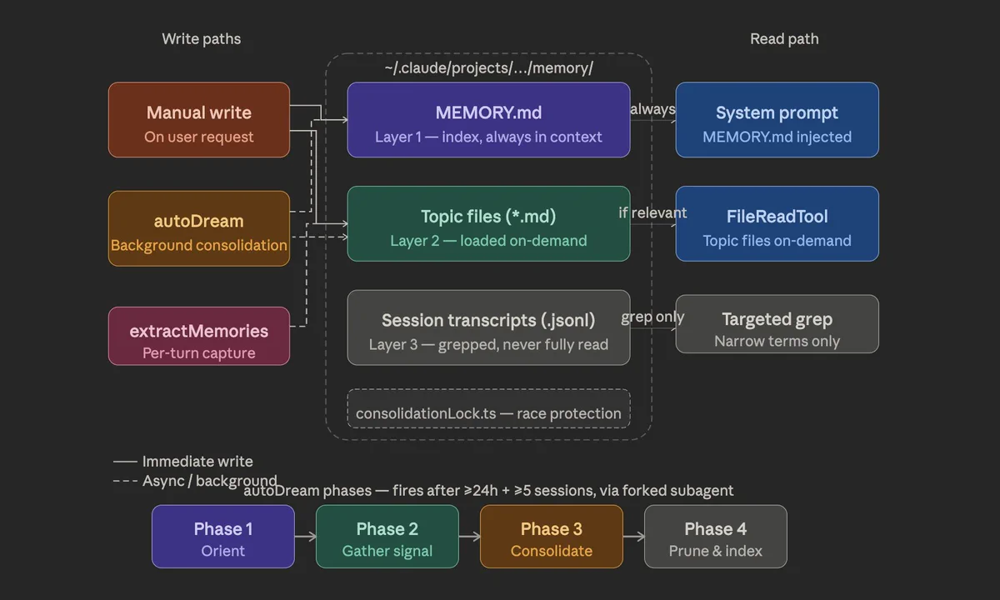

*Memento (2000): carrying evidence into the next decision. 

## Remember when it matters 

In [Part 1](https://www.heavybit.com/library/article/long-horizon-agents-from-order-takers-to-outcome-owners), I laid out the five systems I believe are missing before agents can graduate from completing tasks to owning outcomes: Memory, learning, goal orchestration, a durable execution layer, and a toolchain ecosystem. This post dives into agent memory.

To understand agent memory, we shouldn't think of it as a place to store the past. We need to think of it as a harness-level control system that decides which previous experiences should affect future behavior. The need for memory in the long-horizon context should be clear, but to provide a few examples:

* An agent cannot pursue a goal over months if it forgets why the goal/sub-goal matters
* Learning can't happen without memory, and an agent cannot learn if the outcome of one attempt disappears before the next
* It cannot coordinate with other agents if each action begins with an isolated view of the organization

It is tempting to describe this as a storage problem. Save the agent's interactions, embed them, and retrieve the closest results before the next model call. That produces persistence, but not necessarily memory. A useful memory system must decide what to write, how to represent it, when to retrieve it, how to resolve conflicting information, and whether/how an outcome should modify future behavior. The systems covered here implement this functionality *outside* the model, in the harness layer that controls the agent loop.

## Memory as a Stateful Control Loop

At time `t`, an agent receives an observation, assembles context and chooses an action. We can therefore describe a simplified agent without persistent memory as:

```
action_t = model(instructions, recent_messages, observation_t)
```

A memory-augmented agent adds persistent state `M_t`, a write policy `F`, a retrieval policy `R`, and a context budget `B`:

```
context_t = R(query_t, M_t, B)

action_t = model(
  instructions,
  working_state_t,
  context_t,
  observation_t
)

M_t+1 = F(
  M_t,
  observation_t,
  action_t,
  outcome_t
)
```

`F` determines which observations become persistent state and how they revise existing records. `R` selects the state that reaches the next model call. Both can combine stochastic compute and deterministic code. Outcomes may arrive much later than actions. The write path must associate delayed evidence with the original action and revise any lessons derived from it.

The implementation of memory comes down to three connected choices: the write policy, the read policy, and the storage representation. Claude Code gives us a concrete example of how a harness combines them.

I came across [himanshu's walkthrough of Claude Code's memory architecture](https://x.com/himanshustwts/status/2038924027411222533) while reading about memory systems. The diagram separates the paths that create and revise memory from the paths that bring it back into context:

[](https://x.com/himanshustwts/status/2038924027411222533)

*Source: [himanshu on X, March 31, 2026](https://x.com/himanshustwts/status/2038924027411222533). This is a source-code analysis, not an official architecture diagram. Internal mechanisms such as `autoDream` and `extractMemories` reflect the version analyzed. The walkthrough below uses public documentation for shipped behavior.*

To follow these choices through one task, imagine using Claude Code to investigate a database migration that broke an older worker. During the investigation, the developer explains that customers upgrade their workers independently of the backend, and that a rollout tracker records which versions are still running. What should survive it, and how should that information affect the next migration?

## Write Policy: What Becomes Memory?

A write policy determines what gets retained, who interprets it, and when the result becomes available. Three approaches are useful to distinguish:

**Automatically capture execution.** Claude Code [records messages, tool calls, and results](https://code.claude.com/docs/en/how-claude-code-works#work-with-sessions). Recording means preserving a failed query, the investigation, and any developer explanation, but does not require immediate decisions on which details matter. Deferring interpretation moves that work to the read path, as someone will need to search for and interpret it later. Retention matters too: deleting the source records removes the option to revisit them.

**Let the active agent write a memory.** Claude Code's [auto memory](https://code.claude.com/docs/en/memory#auto-memory) selectively saves user info, feedback, context, and references, skipping facts recoverable from code or Git history. The difference is what is *worth* saving. Git already records which data column changed. A useful memory preserves the operating constraint and where to verify it: “Customer workers upgrade independently. Before removing schema compatibility, check the customer rollout tracker.” This approach requires less reconstruction on the next run. However, there’s a risk of misinterpreting a one-off issue, like a customer delay, as a hard-and-fast rule to implement (which can be mitigated with notes/references to supporting evidence).


*Memento (2000): a photograph records an observation; the handwritten note tells a future self how to act. Not all preserved instructions are trustworthy. [Still via Pictures in Motion](https://picinmotion.wordpress.com/2012/07/11/director-dissection-christopher-nolan-memento-2000/).*

**Use a separate extraction pipeline.** Another approach is processing recorded sessions independently of the agent with an *extractor*. Converting the resulting data from the job into appropriate data fields provides a consistent schema and lets us rerun extraction when the policy changes, provided the source history survives. However, the extra processing adds cost and potential risk of misinterpreting evidence. It also separates *extraction* (used to identify candidate facts) from *consolidation* (deciding whether new facts should update an existing memory). See [Letta Code's context repositories](https://www.letta.com/blog/context-repositories/) for documented examples of using background consolidation to update agent memory.

*Note:* These write policies are *not* mutually exclusive. For example, you could retain an exchange, add a brief reference, and reconcile it with other experiences later. You would need to account for delays if subsequent processing happens in the background. An immediate retry must receive a newly discovered constraint directly or wait until it becomes available through retrieval.

## Read Policy: What Reaches the Model?

On a later migration, the useful question is whether the proposed change affects independently upgraded workers. The read policy determines how information about that constraint reaches the model. Here, too, there are three approaches:

**Include designated records automatically.** One approach is to keep a small set of instructions or pointers within context. Claude Code [loads a bounded `MEMORY.md` index at conversation start](https://code.claude.com/docs/en/memory#how-it-works): the first 200 lines or 25KB, whichever comes first. This limits the startup index loaded into context, not the total memory stored on disk. Detailed topic files are read on demand. This approach connects *read* with *write* because a concise and descriptive entry makes the right notes easier to discover (and bad descriptions make it harder).

Automatic inclusion makes discovery more predictable, but consumes context even on unrelated tasks. It also requires a choice about what deserves that space. `CLAUDE.md` supplies persistent instructions; auto memory contains Claude's own notes. Both guide behavior rather than enforce it. A deployment constraint that must be guaranteed needs an execution check as well as a reminder. [Claude Code's documentation explains this distinction](https://code.claude.com/docs/en/memory#claudemd-vs-auto-memory).

**Have the harness retrieve and assemble context.** Another approach runs retrieval *before* selected model calls, without waiting for the model to request it. In our example, a migration-aware harness could identify affected services/schemas, retrieve relevant deployment constraints, and attach them to the next call. (This approach would support exact filters with structured records and allow free-form notes to be text-searched.) The benefit here is that retrieval is not constrained by whether agents *think to search*. However, this policy carries the risk that the harness might introduce new issues (like constructing a poor query, returning stale records, or filling context with superficially similar stuff).

**Let the model retrieve memory as needed.** Another approach is to let agents use tools to investigate. For example, [Claude Code combines upfront context with on-demand retrieval](https://www.anthropic.com/engineering/effective-context-engineering-for-ai-agents), so the model can discover a clue, refine its question, and perform additional retrieval. Agents using this policy might start by reading a rollout note, follow its reference to the tracker, and check current worker versions before proposing a migration (or, if the task was about why the original migration failed, it would search retained session records for more details). This approach adds flexibility but also adds costs for model calls and tool use. Having a compact index can help an investigation start better, but isn’t a guarantee it will end well, as agents may fail to search, choose the wrong note, or stop short of checking the source.

*About retrieval and memory overhead*: *Who* initiates retrieval is separate from *how retrieval works*. Both automatic and agent-requested reads can use exact lookups, keyword search, vector similarity, or graph traversal. (Harnesses can also combine policies like including a small index while auto-retrieving known task constraints and letting agents investigate further.) The goal is to select enough evidence for decision-making without having to load the entire history into every call.

[*Compaction*](https://learn.microsoft.com/en-us/agent-framework/concepts/agents/conversations/compaction) (condensing older conversation history, reasoning, and tool outputs to conserve context window) can also help here. Claude Code’s approach is to [summarize a growing conversation within its context window](https://code.claude.com/docs/en/how-claude-code-works#when-context-fills-up), supporting continuity within a session while treating the selection of durable lessons for future sessions as a separate decision.

## Storage: Representation, Backend, and Indexes

There are multiple ways to represent an agent’s experience, including an execution record, a written lesson, a structured fact, or a relationship. Your choice determines what aspects of an agentic job you can preserve and query directly. (Your backend determines how records persist and how to coordinate concurrent access.) We’ll cover four approaches below:

**Raw logs and artifacts.** Claude Code's session transcripts illustrate how the harness retains interactions. Files or object storage can also hold command output, patches, and other artifacts. Such artifacts help agents investigate and reprocess, but even a full history does not guarantee you can immediately identify which constraint applies to the current job. A later read or derived view must resolve that.

**Text files and summaries.** Claude Code stores auto memory as Markdown under `~/.claude/projects/<project>/memory/`, with a `MEMORY.md` index and individual topic files. Different memory types appear in [*frontmatter*](https://code.claude.com/docs/en/memory#auto-memory), and the [default memory is local to the machine](https://code.claude.com/docs/en/memory#storage-location).

Here is an illustrative layout for our example:

```
memory/
├── MEMORY.md
├── feedback_migration_compatibility.md
└── reference_customer_rollout_tracker.md
```

The index helps discover the notes, which explain the constraint and point to its source. Using ordinary file tools makes such summaries easy to inspect and revise. Also, files can contain structured metadata, even if our system chooses to use Markdown. The challenge here is consistency, since notes can be readable while contradicting each other. Adding versioning makes changes reversible, but does not validate them. (See Letta Code, below, for an example.)

**Structured records.** If you need to answer questions across many customers and deployments, another approach is using rows or documents for important fields like `customer_id`, `worker_version`, `observed_at`, and `source_event_id`. Using fields lets agents filter and make explicit version checks. The schema must distinguish when a worker changed version from when the agent learned about it. Overwriting a field with its latest value loses that distinction unless earlier versions are retained.

**Entity-relationship graphs.** Using graphs could connect customers to worker fleets, fleets to software versions, and versions to schema requirements. Adding temporal relationships could indicate when each dependency applied. With graphs, multi-step questions (like which customers still depend on a particular column) become easier to express. However, as underlying deployments change, graphs require extraction, entity resolution, and updates to remain accurate.

*Note: [Vector indexes](https://www.ibm.com/docs/en/db2/12.1.x?topic=indexes-vector)* (specialized data structures that organize embeddings to speed up searches) can sit *alongside* different representations to find similar content. However, vector indexes do *not* determine whether facts are current, whether records refer to the same worker, or whether a proposed lesson is justified. For example, selection, organization, and retrieval seem like a huge part of memory design for Claude Code, even when the durable records are ordinary files. (For more on latent and parametric memory, see the report [Memory in the Age of AI Agents](https://arxiv.org/abs/2512.13564).)

[Inside Out](https://www.youtube.com/watch?v=IQ8Aak-k5Yc "embed")

*Inside Out (2015), Disney/Pixar: the Forgetters clear memories from long-term storage. What gets discarded is a policy choice, deleting evidence removes the option to reinterpret it later.*

## How Existing Systems Combine These Choices

Below are some real-world examples of how different platforms approach agentic memory, according to publicly available source code or architecture explainers. The comparison refers to the linked implementations; a managed service can differ from its open-source counterpart.

### Letta and Letta Code

* **Write:** Agents edit persistent memory using tools, with background agents handling consolidation. Letta Code's [context repositories](https://www.letta.com/blog/context-repositories/) let memory agents work in isolated Git worktrees and merge their changes.
* **Read:** Letta uses a combination of automatically including records and using agents to access additional memory through tools. In context repositories, the file hierarchy helps it discover material to load on demand.
* **Store:** Letta abstracts context window storage as [*memory blocks*](https://www.letta.com/blog/memory-blocks/), which persist labeled, size-limited text. Context repositories represent memory as versioned files, with designated files loaded into the prompt.

Letta’s approach gives capable models flexibility over both representation and retrieval. Because Letta allows for persistent memory editing and on-demand retrieval, the correctness of a job depends on editing and search decisions. Version control provides rollback capability, but does not validate the meaning of a memory update.

### Mem0's Managed Platform

* **Write:** Mem0’s [extraction pipeline](https://docs.mem0.ai/core-concepts/memory-evaluation) processes conversations asynchronously, extracts ADD-only facts, deduplicates them, creates embeddings, and adds entity links and temporal metadata.
* **Read:** Mem0 ranks information relevance based on semantic, BM25, entity, and temporal signals. Temporal relevance adjusts rank based on the query's time requirements rather than excluding every stale candidate.
* **Store:** Memory text, embeddings, and metadata live in a vector database. Mem0 uses an entity store to link related memories, and retains addition history and a rolling message window using SQL.

Mem0’s approach uses a standardized pipeline to interpret information during an agentic run. The platform takes the approach of preserving evidence by appending changed facts, but it leaves version resolution up to retrieval and reader. (Mem0 also publishes an [open-source implementation](https://github.com/mem0ai/mem0) that differs from the managed architecture described above.)

### Graphiti and Zep

* **Write:** [Graphiti](https://github.com/getzep/graphiti) extracts entities and relationships from incoming episodes. The platform can preserve evidence history but allows new evidence to invalidate previous relationships.
* **Read:** The platform uses a [hybrid search](https://help.getzep.com/graphiti/working-with-data/searching) approach that combines semantic and BM25 retrieval with rank fusion. It also offers configurable recipes, which add graph traversal and node-distance ranking/cross-encoder reranking.
* **Store:** Graphiti uses a variety of artifacts for storage. Episodes retain source evidence, graph nodes represent entities, and edges represent relationships with temporal validity. (It should be noted that Graphiti is the open-source framework and Zep provides managed context-graph infrastructure.)

Graphiti’s approach to resolving changes during ingestion makes applicable state more explicit at read time. The trade-off here is that correct extraction becomes much more important. If the agent merges distinct workers or invalidates the wrong relationship, it may also corrupt subsequent retrieval.

### cognee

* **Write:** cognee uses configurable pipelines to ingest data, extract entities and relationships, and enrich existing memory. Later, the platform can also run [improvement passes](https://docs.cognee.ai/core-concepts/main-operations/improve) that incorporate useful session information into the permanent graph.
* **Read:** cognee’s retrieval uses vectors and graph structure. The [recall interface](https://docs.cognee.ai/core-concepts/main-operations/recall) supports different modes according to the evidence/answer required.
* **Store:** cognee’s [architecture](https://docs.cognee.ai/core-concepts/architecture) combines relational records (for source metadata and provenance), vectors (for semantic search), and a graph (for entities and relationships).

cognee’s approach lets teams customize the process of transforming source data to searchable memory. However, the approach also uses multiple derived representations, which creates extra maintenance overhead. Failed jobs can leave indexes incomplete, and corrections must propagate through dependent records.

### Mubit

* **Write:** Mubit uses asynchronous ingestion to classify typed entries. The platform has a [learning loop](https://docs.mubit.ai/concepts/learning-loop) that attaches outcomes to memory identifiers and uses reflection to derive conditional lessons for validation and promotion.
* **Read:** The platform uses [recall queries](https://docs.mubit.ai/concepts/retrieval-semantics) to combine semantic, lexical and temporal signals with working state and lesson overlays. Outcome history influences ranking, and a direct mode returns evidence without model-based routing or answer synthesis.
* **Store:** Mubit’s documented [memory model](https://docs.mubit.ai/concepts/memory-model) includes facts, traces, lessons, rules, workflows, and exact archives, with a separate, mutable working state (rather than specifying a particular database backend).

Mubit’s system is able to prioritize procedural guidance over raw history using typing and outcome signals. This is a good benefit that depends on reliable attribution, since even a successful deployment doesn’t necessarily prove that every retrieved lesson contributed to it.

## Memory Is Still Taking Shape

Agent memory is still a young category. The systems above offer different answers to the same questions: what should survive an interaction, how should it change as new evidence arrives, and when should it influence the next decision? The platforms need to mature as we ask agents to carry that knowledge across longer periods, more tasks, and more people.

The boundaries are unsettled too. When a memory system turns a failed run into a reusable lesson and evaluates whether that lesson improves future outcomes, it overlaps with learning. When it decides what context to assemble and when an agent should retrieve more information, it overlaps with the agent framework. We don't yet have settled answers about which responsibilities belong in a dedicated memory platform and which belong in the harness around it.

For builders, those open questions are part of the opportunity. There is room to improve how agents reconcile conflicting evidence, retire outdated guidance, and measure whether remembering something actually leads to a better decision. It's an exciting time to be building in this space. The choices being made now will shape how agents move from completing isolated tasks to owning outcomes over time.
