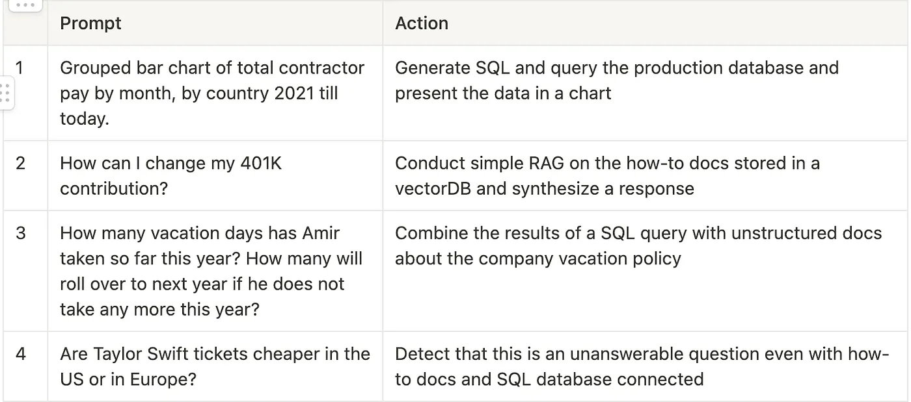
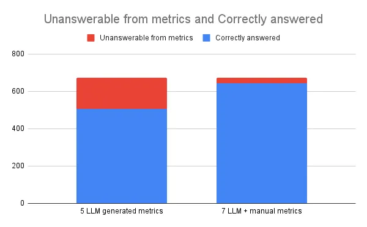

*Originally published on [Relta Blog](https://medium.com/relta)*

In an earlier post, I talked about text-to-SQL, the excitement around it with the launch of ChatGPT and the subsequent disappointment of users, founders and investors. Assuming people actually want to interact with software in natural language (which I think is self-evident), the follow up question is whether these interfaces are even possible to build with today's tech. But first: what does a good natural language interface to data look like?

## Who can design a good natural language interface?

Before talking about the technical feasibility of some technology, we should take a look at the product that developers are trying to build with it. The main natural language interfaces currently in use are AI assistants (aka chatbots that can do take actions). One overarching challenge with building an AI assistant is that unlike a GUI which has breadcrumbs and visual queues to queue possible interactions, users often don't know what they can prompt the assistant for. Therefore, a well designed AI assistant must be able to identify unanswerable cases for its domain, and nudge the user towards items it is trained to handle. Furthermore, it will often need to route the question to different data sources it is connected to depending on the question.

Let's take an example of an AI assistant for some generic HR software. The AI Assistant needs to classify and retrieve data from different data sources for each of the following types of questions:

The ability to detect "unanswerable" questions is important in building trust between users and the AI assistant. If the assistant hallucinates answers to questions it cannot ground from a data source, users will stop using it. In the real world, companies tend to roll out new data connections for their AI assistants over time, often starting with unstructured sources first (similar to #2 in the above sample). In such a case if the assistant receives any of the other questions it should refrain from answering and suggest the topics it currently can cover. The issue of answerability will come up again as we dive deeper into connecting relational data sources to chatbots.

## Connecting relational data

Circling back to the main topic of this post: assuming our AI assistant covers the basics on answerability and routing, can a tool be built for it handle questions from relational data reliably? We saw in part 1 of this blog series that allowing an LLM agent to write raw SQL will not work, as natural language is ambiguous and the solutions space of possible SQL statements is far too large.

An approach that has gained mindshare recently is to use a semantic layer (or metrics layer). This approach introduces an intermediate step where the natural language user input is matched to a set of pre-defined metrics and the metric is then compiled into SQL. The idea of a metrics layer in data stacks is not new. In a popular blog post from 2021 on self-serve analytics Benn Stancil (ex-CTO of Mode) popularized the idea of a metrics layer by pointing out that:

> Self-serve [analytics] is a misunderstood (or, at least, misrepresented) problem. Because the most common question people have is "How often did this thing happen?," effective self-serve is less about complex analysis and more about metric extraction. People "want to choose from a list of understood KPIs, apply it to a filtered set of records, and aggregate it by a particular dimension. It's analytical Mad Libs — show me average order size for orders that used gift cards by month."

The observation above was not about natural language interfaces to SQL data. However at a product level, anyone interacting with an AI assistant to retrieve data is doing self-serve analytics. We set out to validate this hypothesis by analyzing real world usage of Dataherald's text-to-SQL engine and the hypothesis was proven correct.

## Real-world validation

In one case, a Series B accounting software vendor had rolled out an AI assistant to its internal support team of accountants that answered customer questions from their data. Their connected dataset consisted of:
- 71 tables 
- 574 total columns

From a set of 674 user prompts:
- 650 (~96.5%) were answerable
- 14 (~2%) were unanswerable due to being normative
- 10 (~1.5%) were unrelated to the data

We then used an LLM to generate a metrics layer based on the DDL and 92 sample natural language prompts. The suggested metrics layer had a total of **5 metrics** which only referenced **28 of the underlying 574 columns** in the underlying data (less than 5%). Running the test set of 674 prompts, 75% were answered accurately using the suggested metrics layer. This number was increased to 95% by manually adding two uncaptured metrics, so almost all of the answerable questions were captured with **7 metrics with 35 columns referenced from the 574 total columns**.

## Rephrasing the problem

So to build an accurate natural language interface we need an engine that can:

1. Set up an initial metrics layer from the underlying datasource and some sample questions
2. Match questions to the metrics layer to identify answerable, unanswerable and unrelated questions
3. Suggest new metrics to the developer that can be deployed

We took the learning above (plus data privacy when building Dataherald) to work on Relta.

In the next post I will discuss the details of how we built this engine at Relta.