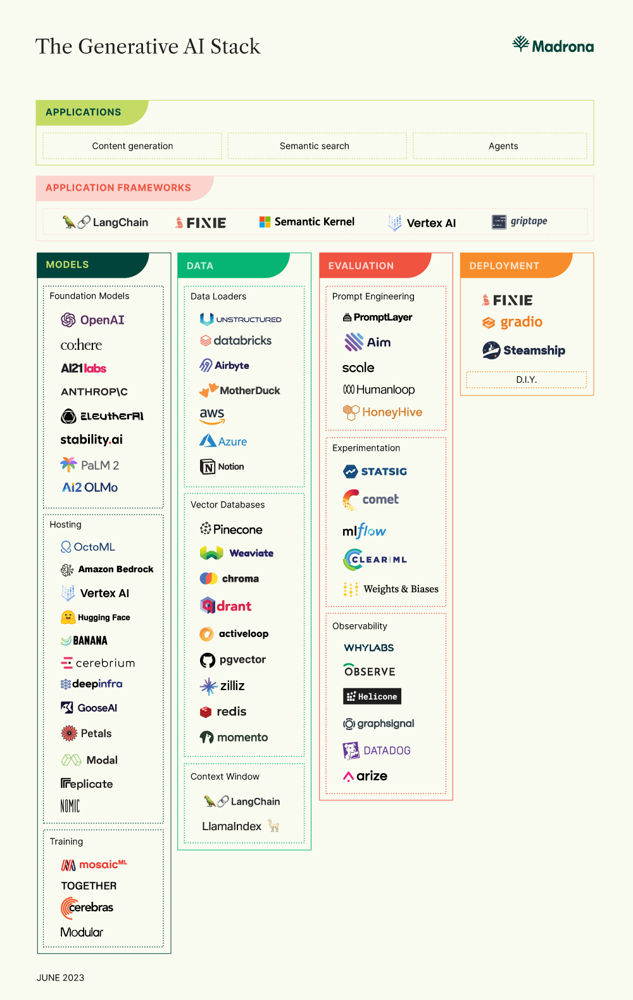
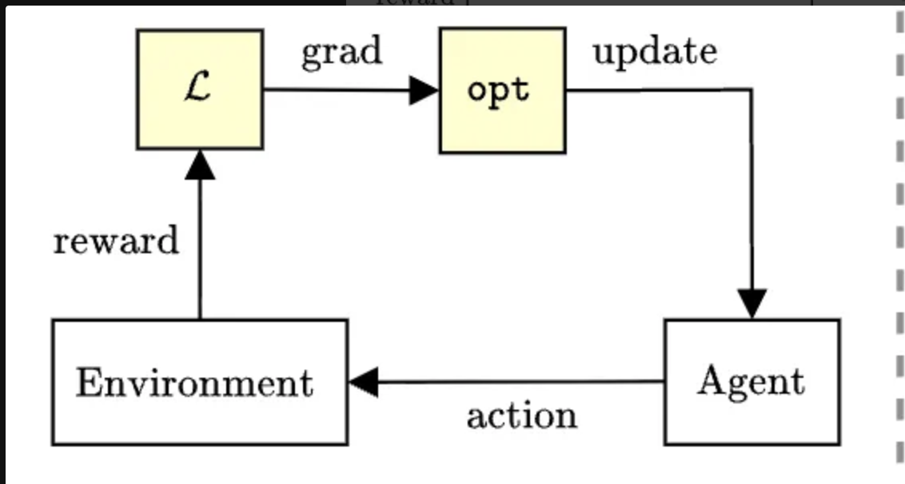

During a discussion earlier this week with a friend working on an RL engine at a major academic lab, he mentioned his 
strongly held belief that an "RL infra company” can never be a viable standalone business. 

I was shocked: not only because of who was saying it but also due to the mindshare and investor interest RL commands these days.

But he has a point. From ~50 companies on Madrona's market map from a couple years ago only 4 are 
focused on model training. Of those, one (Mosaic) was acquired, one (Cerebras) is mainly a hardware company, and Together and Modular now bill themselves as inference providers. 

So, **is RL/post-training infrastructure a venture-scale category by itself?** Or should we think of it as a feature
for inference providers and a workflow for the makers of foundational models? 

## RL is Already Big Business

Billions are already being spent on RL:
- Mercor claimed to be at $500M of annual revenue in September 2025
- Databricks reports $1B of AI revenue which includes RL from their Mosaic acquisition 
- Anthropic and OpenAI are pouring money into post-training and RL as pre-training hits scaling laws and we run out of human-generated text data.

If you went to NeurIPS in San Diego in December 2025, you would have felt like AI==RL.

At the same time there is no single large infrastructure company that is focused on RL or post training infrastructure. 
[Unsloth](https://unsloth.ai/) and [Prime Intellect](https://www.primeintellect.ai/blog/lab) are the only companies I'm aware of dedicated solely to post-training infra.

## Training is hard. Inference is eas(ier)

Doing inference reliably at scale is not easy. GPUs are scarce, context windows are exploding, and managing KV caches at scale is real engineering work. 
But it is, fundamentally, an infrastructure problem, not a research problem.

There are open models, open inference stacks like SGLang and vLLM, optimized kernels, routing layers, and cloud abstractions. 
If you have capital and good engineers, you can stand up an inference service.

Training is a different beast, and RL in particular is [messy, unstable, and expensive](https://www.dwarkesh.com/p/bits-per-sample). 
You are interacting with environments, defining reward functions, and fighting regressions. 
While in theory models now have enough base intelligence to be able to do long form white collar work with RL based
post training, the bottlenecks to delivering this vision are not generalizable algorithms and infrastructure.  

## The Environment and Verification Bottleneck

The [current consensus](https://www.datagravity.dev/p/rl-environments-for-agentic-ai-who) is that we can deliver 
autonomous agentic AI from our base models through post training with RL, and that the blockers to delivering these agents are synthesizing the **environments** that mimic long horizon tasks and defining **verification** methodology needed to determine correctness on these tasks. 
As tasks being automated become longer and more complex, defining what “correct” means becomes unclear and needs deep domain expertise. Reinforcement learning depends on reward signals, but in real work those signals are ambiguous, 
gameable, and can shift in long-horizon multi-turn tasks. I believe one of the key reasons software development was the first domain the labs delivered autonomous long horizon 
agents (i.e. Claude Code) was that the people who worked at the labs **are the domain experts** in writing code, and verifying software correctness is fairly straightforward. 

Bottlenecks present business opportunity and there is already a growing market around the problem of RL Environments and Verification. 
Frontier labs are the earliest and most concentrated buyers of RL environments and companies like [Mercor](https://mercor.com/) and [Halluminate](https://halluminate.com/) are positioning themselves 
upstream as suppliers of expert feedback, evaluation scaffolding, and environments. 

Companies like [Applied Compute](https://www.appliedcompute.com/) (and some RL consulting shops) are taking another approach: instead of asking enterprise workers and recent grads to moonlight
and create RL gyms, they are going to enterprises directly and leveraging artifacts created by their workforce to build "autonomous workers" owned by the enterprise. This makes sense: if you are a large bank or hedge fund, in order to prevent Anthropic or OpenAI from cannibalizing your business, you should capture artifacts created by your workforce (docs, screen and mouse clicks) to train your own autonomous workforce.

## So, Can You Build a Company Around RL?

Yes, but it won't look like inference.

The inference providers won because they solved an infrastructure problem: serve models fast, reliably, and at scale. Capital and good engineering get you there. But a standalone RL business cannot win on speed or scalability alone. The bottleneck isn't infrastructure, it's the algorithms and the complex data pipelines needed to see value from them.

A viable RL company needs to deliver something fundamentally new: **continual learning** from on-policy RL. Any such service will need to:
1. Include pipelines that synthesize RL environments from model outputs
2. Automatically build (or at least propose) reward signals and verification 
3. Update model weights and biases in the background with little human intervention.

Today, this is a [research problem](https://arxiv.org/pdf/2601.19897). Whoever solves it can create a generational company.

