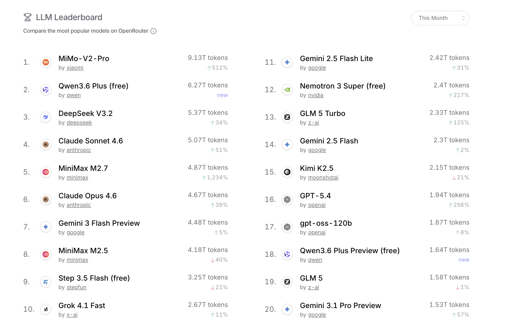

## The Tell

On March 19, 2026, Cursor launched [Composer 2](https://cursor.com/blog/composer-2), calling it "coding intelligence at frontier level." 
Within a day, a [developer inspecting API traffic](https://x.com/fynnso/status/2034706304875602030?s=20) spotted a model identifier: `kimi-k2p5-rl-0317-s515-fast`.

Cursor is a ~$50B AI company targeting ~$6B of revenue in 2026, and Composer 2 is the flagship of their product roadmap.
Anthropic and OpenAI both have competing coding agent products in Claude Code and Codex, so it is central for Cursor to own their own models.
And yet they did not train a whole new frontier model from scratch. They started with Kimi K2.5,
an open-weight model from Moonshot AI, post-trained with RL for coding.

Cursor’s VP of developer education [later confirmed it](https://x.com/leerob/status/2035035355364081694?s=20),
somewhat awkwardly adding that "roughly a quarter of the training compute came from that base, the rest is our post-training."

## It Is Cool To Be Closed

In terms of momentum, as measured in the attention economy, the gap between closed and open weight models could not be more stark.

1. In March 2026, Alibaba's Qwen team fell apart. Lin Junyang, the technical lead and the public face of Qwen globally, resigned abruptly. Yu Bowen, the head of post-training, left the same day. Hui Binyuan, the Qwen Code lead, had already gone to Meta in January. Three pillars of the team in ten weeks. The reporting suggests Alibaba is shifting toward consumer DAU metrics and horizontal, product-driven structure.
2. Meta's Llama 4 was a dud. The company reportedly planned a pivot to closed proprietary models (codenames Avocado and Mango) under new Chief AI Officer Alexandr Wang. They've since partially hedged, saying they'll release open versions of the next generation, but the frontier-open-by-default Meta of 2023–2024 is long gone.
3. Ai2 lost Ali Farhadi, Hanna Hajishirzi, and Ranjay Krishna to Microsoft's Superintelligence team in March 2026. The Paul Allen-linked foundation that funds Ai2 is publicly pivoting toward applied AI over frontier open model development.


Meanwhile our closed-model philosopher gods grace magazine covers while a poor robot looks up in awe.

*No Jensen. But a shredded Demis Hassabis, gazed upon by a robot*


## Look Down the Stack

That Cursor is building on open weight is not an anomaly. A quick look at OpenRouter's top models over the past month shows that 4 out of the top 5 
(and 12 of the top 20) most used models are open weight.


*OpenRouter Top Models, snapshot taken April 21, 2026*

The numbers above are not a measure of total AI inference market share, as they don't capture workloads generated from applications developed by OpenAI, Anthropic or any other 
model developer that also build applications. The tokens processed by ChatGPT, Claude Code and Claude CoWork would undoubtedly dwarf the total tokens processed by OpenRouter. 

However the numbers above further demonstrate that application builders are moving away from the frontier labs' hosted offerings towards building their own solutions
on top of open weight models. Increasingly the stack looks like the following.   

```
AI Application Stack

                     user / customer 💵 
                           |
                 +------------------------+
                 |      DISTRIBUTION      | <- Very High Value
                 +------------------------+
                           |
                 +------------------------+
                 |        PRODUCT         |
                 +------------------------+
                           |
                 +------------------------+
                 |     Agent Harness      |
                 +------------------------+
                           |
                 +------------------------+
                 |     Post Training      | <- Very High Value
                 +------------------------+
                           |
                 +------------------------+
                 |   Open Weight Models   |
                 +------------------------+
                           |
                    Jensen Huang 💰 (collecting rent)
```

The stack above shows the AI ecosystem is maturing and usage is growing.

As AI applications move to large production workloads, they need models that are good at the very specific tasks their product does.
Cursor does not need a model that is good at physics and biology, it needs a model that is very good at 
editing code in a real repository with real tools. That is a much narrower target than "frontier general intelligence,"
and spending your compute budget on post-training using the datasets that have been built up from real world use over time.


## Where Open Weights Are The Only Option
The discussions so far have been about LLMs and application stacks built on top. It should be noted there are other areas, such as on-device language models
or Physical AI, where the only options are open weight models. I would argue this is the case because these markets are still very early and
for all the players any progress will help all the ships rise. As these ecosystems mature, we can expect dynamics similar to LLMs to take shape.


## Who Will Pay to Develop Open Weight?
Training LLMs costs a lot of money, and the base models are still improving rapidly even if the pace of progress from pre-training is slowing. Releasing it and getting no API revenue from it is not a business. And yet the application layer described above is quietly being built on this infrastructure and somebody has to pay for it.
In the US, the traditional answer was Meta but the new answer is increasingly no one. Meta is retreating, Ai2's backer is pivoting to applied AI, Mistral has gone into services.
Chinese labs have jumped on this vacuum and used open weight as a wedge for distribution.
But similar to Alibaba and Qwen, one can only assume most of them will lock up their frontier models over time.

The obvious US player with the means and motivation to bankroll open weight model development indefinitely is Nvidia. 
One can only hope they will bring on the team that can turn their [$25B commitment](https://www.wired.com/story/nvidia-investing-26-billion-open-source-models/) to this endeavor into strong models with good distribution. 

## Parting Thoughts
Open source software was declared dead many times. Yet today it powers databases (Postgres ate the world), operating systems, and web browsers (Chromium).
LLMs will not be different. Open weights won't own the frontier of capability and headlines, but they will win at the base layer — the substrate.
Expect a lot of AI products not coming out of OpenAI, Anthropic, and Google over the next 24 months to quietly look a lot like Composer 2 under the hood.
And if you are working on open weight models in the US, my hat's off to you. You won't get a spot on the Economist cover. Powering a diverse AI application ecosystem will have to do.
